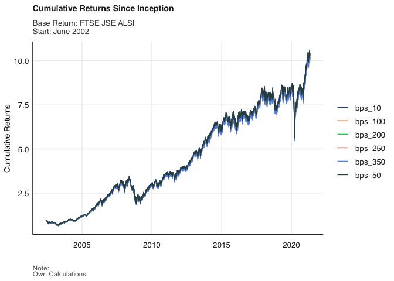
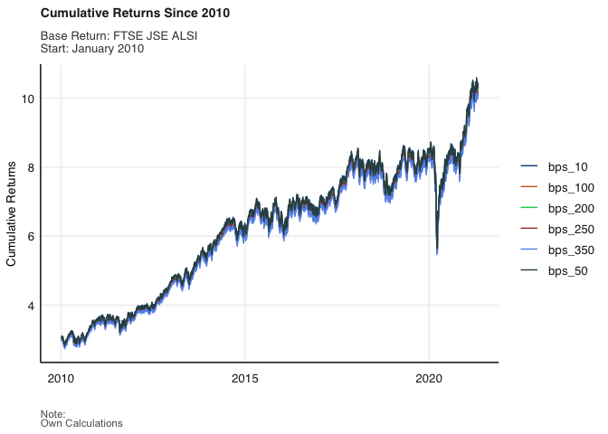
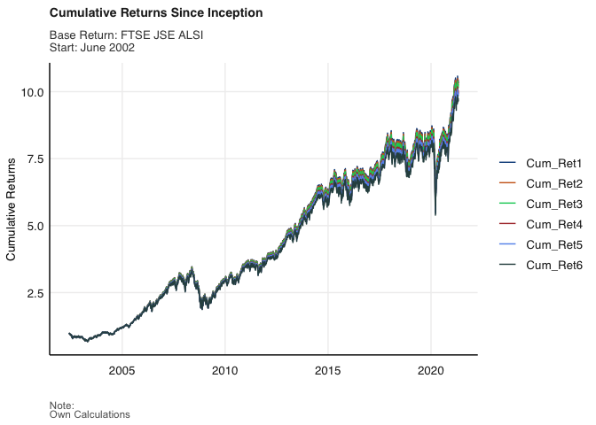

Output: Practical 1
================

``` r
rm(list = ls()) # Clean your environment:
gc() # garbage collection - It can be useful to call gc after a large object has been removed, as this may prompt R to return memory to the operating system.
```

    ##          used (Mb) gc trigger (Mb) limit (Mb) max used (Mb)
    ## Ncells 405312 21.7     829452 44.3         NA   657877 35.2
    ## Vcells 764093  5.9    8388608 64.0      16384  1802283 13.8

``` r
library(pacman)
p_load(fmxdat,tidyverse, rmsfuns, tbl2xts, PerformanceAnalytics, xts, glue, lubridate)
```

# Data loading

Loading in Jalshtr dataset from the fmxdat library.

``` r
dta <- fmxdat::Jalshtr
```

Checking missing values

``` r
sum(is.na(dta$TRI)) #=0... no missing TRI values
```

    ## [1] 0

``` r
sum(is.na(dta$date)) #=0... no missing dates
```

    ## [1] 0

# Cumulative Returns Since Inception

``` r
# Calculating Simple Returns

dta2 <- dta %>% arrange(date) %>%
    mutate(across(.cols = TRI, .fns = ~./lag(.) - 1, .names = "Simple_Returns"))%>%
# Specifying that the first date should be excluded (avoid NA's)
    filter(date>first(date))%>%
# Calculating cumulative returns
    mutate(Cum_Ret = cumprod(1 + Simple_Returns))

# calculating cumulative returns for different bps levels
# (100 bps approximately 1%)

dta22 <- dta2 %>%
  arrange(date) %>%
  mutate(bps_10=(Cum_Ret*0.999))%>%
  mutate(bps_50=(Cum_Ret*0.995))%>%
  mutate(bps_100=(Cum_Ret*0.99))%>%
  mutate(bps_200=(Cum_Ret*0.98))%>%
  mutate(bps_250=(Cum_Ret*0.975))%>%
  mutate(bps_350=(Cum_Ret*0.965))

# In order to create legend (ie by type), need to collect the bps columns into a single one (pivot longer)

dta221 <- dta22 %>%
  arrange(date)%>%
  pivot_longer(cols=starts_with("bps"), 
               names_to="Type",
               values_to="Tyranny" )
  
p1<-
    ggplot(dta221) + 
geom_line(aes(date, Tyranny, colour=Type)) + 
fmxdat::theme_fmx(title.size = ggpts(30), 
                    subtitle.size = ggpts(28),
                    caption.size = ggpts(25),
                    CustomCaption = T,
                  legend.size = 10,
                  legend.pos = "right") + 
    fmxdat::fmx_cols() + 
  
  labs(x = "", y = "Cumulative Returns", caption = "Note:\nOwn Calculations",
       title = "Cumulative Returns Since Inception",
       subtitle = "Base Return: FTSE JSE ALSI \nStart: June 2002")

p1
```

<!-- -->

# Cumulative Returns since 2010

``` r
dta3 <- dta221%>%filter(date>lubridate::ymd(20100101))

p<-
    ggplot(dta3) + 
geom_line(aes(date, Tyranny, colour=Type)) + 
fmxdat::theme_fmx(title.size = ggpts(30), 
                    subtitle.size = ggpts(28),
                    caption.size = ggpts(25),
                    CustomCaption = T,
                  legend.size = 10,
                  legend.pos = "right") + 
    fmxdat::fmx_cols() + 
  
  labs(x = "", y = "Cumulative Returns", caption = "Note:\nOwn Calculations",
       title = "Cumulative Returns Since 2010",
       subtitle = "Base Return: FTSE JSE ALSI \nStart: January 2010")

p
```

<!-- -->

# Attempting to correct for differences in cumulative returns

``` r
# Calculating Simple Returns

dta2 <- dta %>% arrange(date) %>%
    mutate(across(.cols = TRI, .fns = ~./lag(.) - 1, .names = "Simple_Returns")) %>%
# Specifying that the first date should be excluded (avoid NA's)
    filter(date>first(date)) %>%
  arrange(date) %>%
  mutate(bps_10=(Simple_Returns-(Simple_Returns*0.001))) %>%
  mutate(bps_50=(Simple_Returns-(Simple_Returns*0.005))) %>%
  mutate(bps_100=(Simple_Returns-(Simple_Returns*0.01))) %>%
  mutate(bps_200=(Simple_Returns-(Simple_Returns*0.02))) %>%
  mutate(bps_250=(Simple_Returns-(Simple_Returns*0.025))) %>%
  mutate(bps_350=(Simple_Returns-(Simple_Returns*0.035))) %>%
  
# ^ Calculating returns post-fees
  
# Calculating cumulative returns
        mutate(Cum_Ret1 = cumprod(1 + bps_10)) %>%
        mutate(Cum_Ret2 = cumprod(1 + bps_50)) %>%
        mutate(Cum_Ret3 = cumprod(1 + bps_100)) %>%
        mutate(Cum_Ret4 = cumprod(1 + bps_200)) %>%
        mutate(Cum_Ret5 = cumprod(1 + bps_250)) %>%
        mutate(Cum_Ret6 = cumprod(1 + bps_350)) %>%

pivot_longer(cols=starts_with("Cum"), 
               names_to="Type",
               values_to="Tyranny" )


  
p1<-
    ggplot(dta2) + 
geom_line(aes(date, Tyranny, colour=Type)) + 
fmxdat::theme_fmx(title.size = ggpts(30), 
                    subtitle.size = ggpts(28),
                    caption.size = ggpts(25),
                    CustomCaption = T,
                  legend.size = 10,
                  legend.pos = "right") + 
    fmxdat::fmx_cols() + 
  
  labs(x = "", y = "Cumulative Returns", caption = "Note:\nOwn Calculations",
       title = "Cumulative Returns Since Inception",
       subtitle = "Base Return: FTSE JSE ALSI \nStart: June 2002")

p1
```

<!-- -->

Even after changing the way the cumulative returns are calculated (see
README in root folder), the figure above still does not have the same
features as the one we were tasked with replicating.
