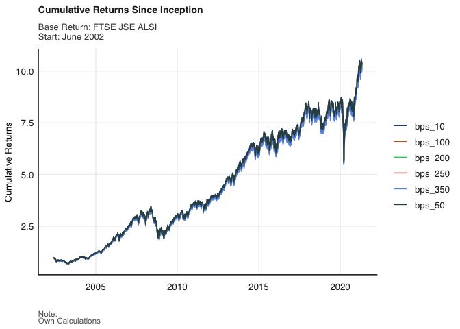
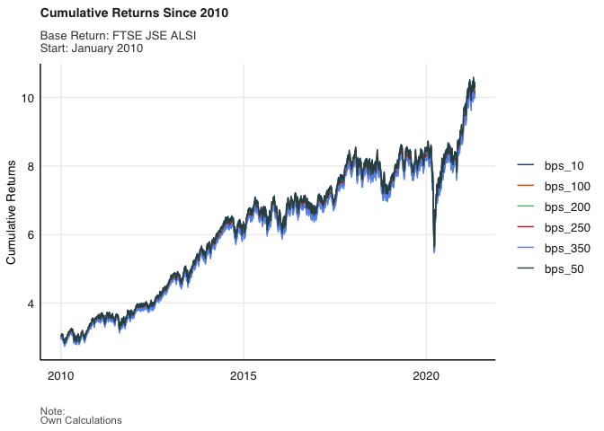

# Purpose

The aim of this folder is show my attempt to replicate two figures
illustrating how different management fee structures effectively eat
into investors overall cumulative returns. This involved first
calculating the returns, starting with simple returns and then onto
cumulative returns. Then calculating cumulative returns for different
management fee structures, from 100bps to 350 bps. And finally ‘pivoting
longer’ the returns for each different level of fees, in order to
specify the colour option in the ggplot aesthetic, and finally plotting
the cumulative returns.

My attempt at this practical exercise, including all code and output
used, can be found in the file ‘Prac_1.md’.

# Data loading

Loading in Jalshtr dataset from the fmxdat library.

``` r
dta <- fmxdat::Jalshtr
```

Checking missing values

``` r
sum(is.na(dta$TRI)) #=0... no missing TRI values
```

    ## [1] 0

``` r
sum(is.na(dta$date)) #=0... no missing dates
```

    ## [1] 0

# Cumulative Returns Since Inception



# Cumulative Returns since 2010



# Attempting to correct for differences in cumulative returns


I was, unfortunately, unable to replicate the figures exactly, the
impact of higher management fees seems to be lower in the figures I
plotted. Upon reflection, I realize that this may be due to the way I
set up the ‘Tyranny’ column. Rather than subtracting the bps (for
management fees), I should have calculated it as the percentage change
in cumulative returns, after subtracting the management fees. ie the
management fees should have been subtracted from the original return
calculation, rather than the cumulative return calculation, and that is
why the effect of greater management fees appears to be lower in the
figures I was able to plot.

The second problem is more of a plotting issue, rather than a
calculation issue. I was unable to replicate the floating caption in the
figure specifying how much R1 million invested in year XYZ would’ve
grown based on different management fee structures.

This was a good opportunity to think more intuitively about how to
approach this sort of plotting problem, and become more used to using
the fmxdat auxiliary plotting functions.

    - Tiago
